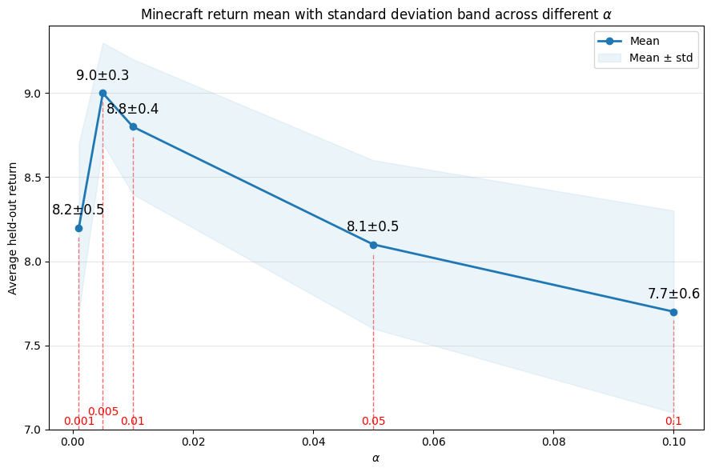
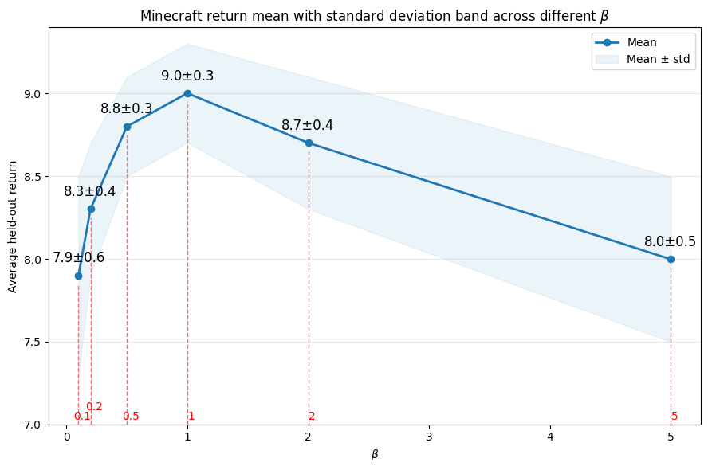

# Supplementary-Material-for-the-Rebuttal-of-ICML-Submission-752

This repository is provided solely as supplementary material for the rebuttal of **ICML Submission 752**.

To ensure compliance with the **ICML rebuttal policy** and the **double-blind reviewing requirements**, the repository contains only:

- experimental figures,
- tables,
- and brief descriptive captions / necessary explanatory text directly associated with those figures and tables.

***No additional substantive text, discussion, or identifying information is included.***

In particular, this repository does **not** contain any extra technical write-up, extended argumentation, author-identifying content, or materials beyond what is permitted under the ICML rebuttal guidelines.

## Relevant ICML Policy

> **Anonymity and Links:** Your responses to reviewers should not contain or link to any identifying information that may violate the double-blind reviewing policy. While links are allowed, reviewers are not required to follow them, and links may only be used for figures (including tables) and captions that describe the figure (no additional text).

## Supplementary Figures for the Rebuttal

### Figure S1. ProcGen result (2 seeds)

.png)

*Caption:* ProcGen evaluation with **2 seeds** on 16 tasks at 50 million steps. FlowMAP remains competitive with strong baselines and is close to Dreamer under this low-seed setting.

---

### Figure S2. ProcGen result (5 seeds)

.png)

*Caption:* ProcGen evaluation with **5 seeds** on 16 tasks at 50 million steps. This figure provides the higher-confidence comparison requested in the review. FlowMAP remains competitive with Dreamer and stronger than the other RL baselines.

---

### Figure S3. Sensitivity analysis for the quantile filtering ratio $\alpha$

*Caption:* Minecraft episodic return under different values of the quantile filtering ratio $\alpha$. Performance is strongest in the small-to-moderate range, with the best result observed near $\alpha=0.005$. The trend suggests that FlowMAP is not overly brittle to $\alpha$ within a reasonable operating region, while very large filtering ratios degrade performance.

---

### Figure S4. Sensitivity analysis for the temperature parameter $\beta$

*Caption:* Minecraft episodic return under different values of the temperature parameter $\beta$. Performance is strongest around $\beta=1$, while both overly small and overly large values reduce return. This supports the claim that FlowMAP has a stable intermediate operating region for value shaping.

---

## Supplementary Tables

### Table S1. Atari 100k ablation results

*Caption:* Atari 100k ablation results. For consistency with the main paper, all environments report **episodic return**, i.e., the undiscounted sum of environment rewards over an episode. Brackets denote 95% confidence intervals.

| Method | Mean Return | Median Return | IQM Return |
|---|---:|---:|---:|
| No Flow (RL only) | 101.2 [72.4, 138.5] | 49.5 [38.2, 61.4] | 62.1 [50.5, 75.8] |
| RL + Cons only | 106.5 [75.1, 142.3] | 53.0 [42.1, 65.2] | 66.4 [52.8, 80.1] |
| Flow w/o Value Target | 95.8 [68.1, 130.2] | 52.4 [40.1, 65.0] | 60.5 [48.2, 73.1] |
| Pointwise Value Update | 115.3 [80.5, 155.6] | 55.2 [45.0, 68.3] | 70.4 [58.1, 85.6] |
| VTFM w/o Consistency | 125.0 [85.1, 175.4] | 51.0 [39.5, 63.8] | 68.5 [55.0, 83.2] |
| Frozen Flow | 118.2 [82.0, 160.1] | 60.1 [48.5, 73.2] | 76.2 [62.4, 91.0] |
| Full FlowMAP | 127.4 [90.5, 172.6] | 65.8 [52.1, 80.4] | 85.3 [70.5, 102.1] |

---

### Table S2. BSuite ablation results

*Caption:* BSuite ablation results. For consistency with the main paper, the reported metric is **episodic return**. Values are shown as task-level mean episodic return with 95% confidence intervals.

| Method | BSuite Mean Return (95% CI) |
|---|---:|
| No Flow (RL only) | 54.2 [46.5, 61.8] |
| RL + Cons only | 55.5 [47.2, 63.0] |
| Flow w/o Value Target | 53.8 [45.1, 62.4] |
| Pointwise Value Update | 61.3 [54.0, 68.1] |
| VTFM w/o Consistency | 57.8 [45.2, 69.4] |
| Frozen Flow | 65.2 [59.1, 71.5] |
| Full FlowMAP | 69.0 [62.4, 75.8] |

---

### Table S3. Benchmark setup and resource summary

*Caption:* Benchmark-level setup and resource summary for the supplementary experiments.

| Benchmark | Tasks | Replay Ratio | GPU Days | Model Size | Peak RAM Usage (GB) |
|---|---:|---:|---:|---:|---:|
| Minecraft | 1 | 32 | 1.5 | 200M | 250 |
| DMLab | 30 | 32 | 0.5 | 200M | 245 |
| ProcGen | 16 | 32 | 1.2 | 200M | 320 |
| Atari | 57 | 32 | 0.9 | 200M | 217 |
| Atari 100k | 26 | 128 | 0.1 | 200M | 30 |
| BSuite | 23 | 1024 | 0.1 | 200M | 14 |
| DMC Vision | 20 | 256 | 0.3 | 200M | 95 |
| DMC Proprio | 20 | 1024 | 0.4 | 1M | 18 |

---

### Table S4. Hardware configuration

*Caption:* Hardware used for the supplementary experiments. Unless otherwise noted, each run used a single GPU.

| Item | Value |
|---|---|
| GPU Model | NVIDIA RTX A6000 |
| Number of GPUs Available | 8 |
| GPU Memory per Card | 48 GB (49140 MiB reported) |
| CUDA Version | 12.2 |
| Driver Version | 535.288.01 |
| Per-Run GPU Usage | Single GPU |
| Total System RAM | 528 GB |

